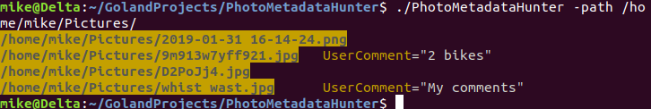

# What does it do?

This utility helps you see photo meta data for folder of images. Images can have embedded data
which describes the image, the equipment used for capturing the image, or the creator of the image. 
This program uses a standard called Exif. See https://en.wikipedia.org/wiki/Exif for more information
about this standard. 

The following fields are displayed: ImageDescription, UserComment, Artist, MakerNote

Only fields with values are displayed. 

# Usage
This is a command line application, so you'll run this in your terminal. 

Sample execution specifying no path. If no path is specified, the application assumes "." 
is the path to search. 

`PhotoMetadataHunter`

Sample execution with a path. For Windows, use backslashes in your folder path and do not leave a trailing 
slash. 

`PhotoMetadataHunter -path /home/myuser/photos`

# Troubleshooting

If you are not seeing some image files, this may be because an error was encountered while trying to 
read some of the files. This may be caused by corrupted images files or insufficient permissions. 

Additional information can be displayed to the console for troubleshooting by setting the 
consoleLogLevel flag. 

`./PhotoMetadataHunter -path /home/mike/Pictures/ -consoleLogLevel Trace`

# Developer notes

## Dependencies

Getting dependencies needed to build this repository. Depending on your environment, you may need to install GCC before retrieving the following packages. 

`go get "github.com/sirupsen/logrus"`

`go get "gopkg.in/gookit/color.v1"`

`go get github.com/rwcarlsen/goexif/exif`

## Why aren't there modules?

Basically, I had a lot of trouble with modules and gave up. I developed this in Go 1.11.4 and I encountered problems 
running tests or using some of my dev tools while using modules. It seems that subsequent versions of go will fix 
some of these problems and maybe I'll try again. 
